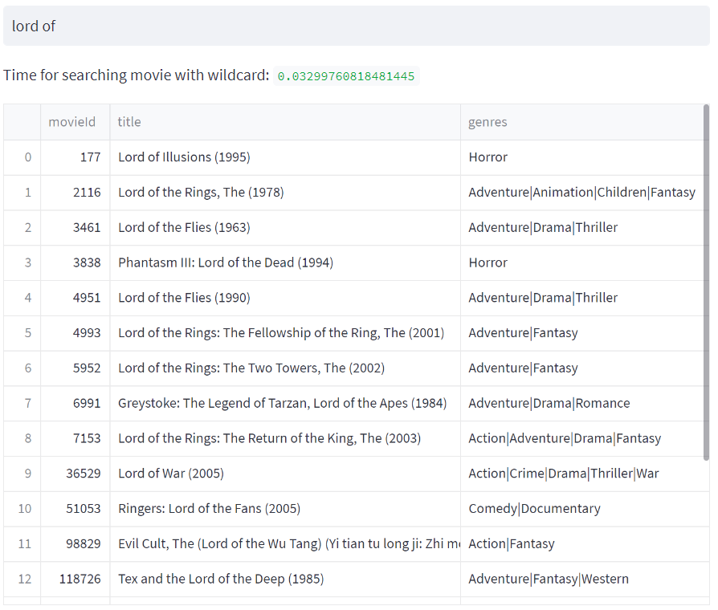
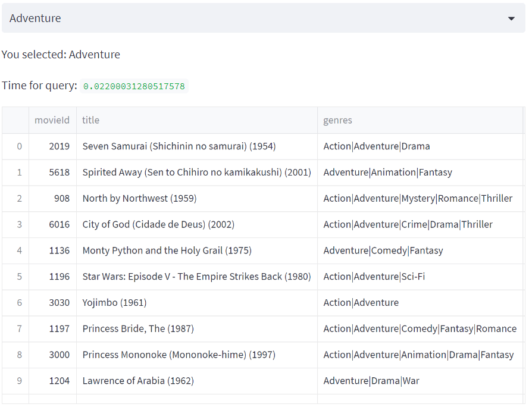
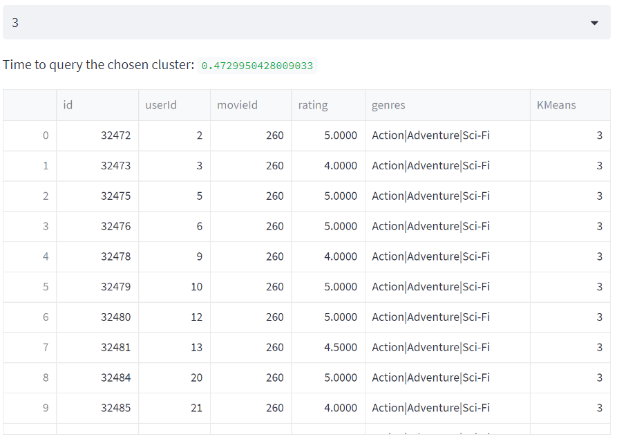
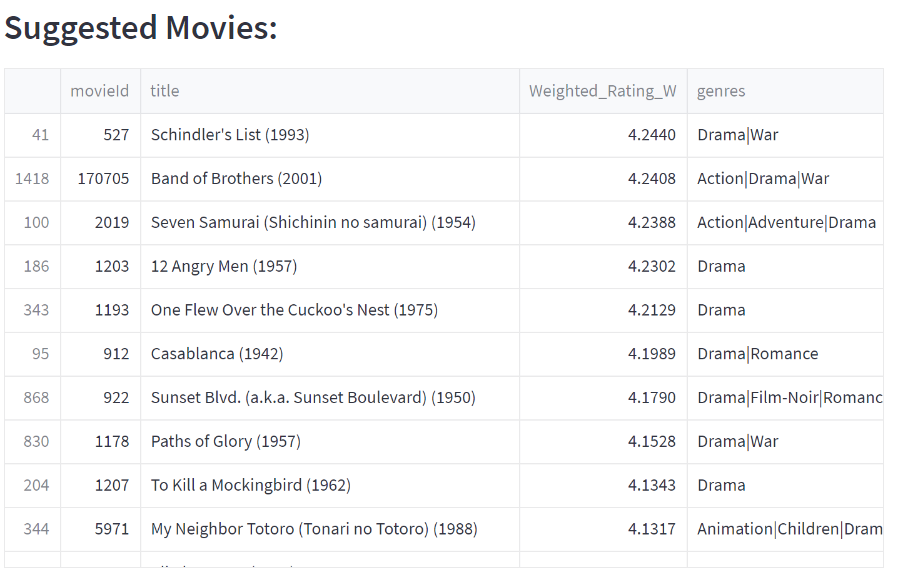

# Movie Recommender

Using the [MovieLens](https://grouplens.org/datasets/movielens/) dataset, I have developed a recommendation system by clustering users according to their ratings for genres.

## Installation

Use streamlit to start the application in an Anaconda environment.

```bash
conda install -c conda-forge streamlit
```
Use SQLAlchemy to connect to database
```bash
conda install -c anaconda sqlalchemy
```
Create a SQLite database with my script initializing the tables, primary and foreign keys and the data types for all columns
```bash
python code\import_to_database.py
```

## Usage
Run the application with the following command:
```bash
streamlit run code\homepage.py
```

## Task 1 - View Movies
Type a page number in the input box and you can see the movies in that range:


## Task 2 - Search Movie
Search a movie by title:


## Task 3 - Top 10 Movies by category
Using Bayesian Estimation I have calculated a weighted rating for each movie. Using this rating, I show the top 10 movies by category.


## Task 4 - Grouping Similar Users
Using the KMeans clustering algorithm, I group similar users together by their interests in movie genres. The interest is represented by their ratings. There are 20 genres in total in the dataset. I created 20 clusters from the dataset assuming there will be at least 1 genre that a group will prefer. Sometimes, users in a cluster overwhelmingly dislike some genres. In this case, I will take movies from the least disliked genres and recommend movies from them.

An example of users belonging to cluster 3:


Graph showing their interest by genres:


## Task 5 - Movie Recommendation
Using the clusters formed in Task 4, I find out which genres do users in a cluster like or dislike. To do that, first we enter a user ID for whom we wish to recommend a movie, for example user ID 1:


If users in a cluster have made at least 15 good ratings, I suggest other movies from the same cluster that the user has not previously seen. It is assumed that a good rating is atleast 4 stars. It is also assumed that an unwatched movie is an unrated movie.


If users in a cluster made less than 15 good ratings, I find the 3 three least negatively reviewed genres and use them to suggest new movies to the user. In this case, the new movies will be suggested from the entire movies pool instead of just the cluster that the user belongs to.
